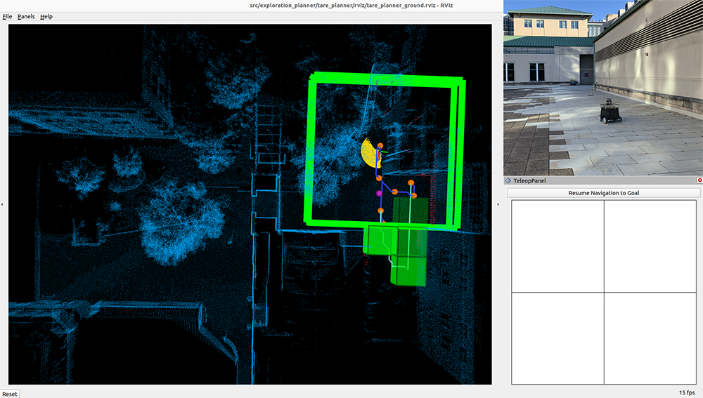

<div align="center">

# SysNav: Multi-Level Systematic Cooperation Enables Real-World, Cross-Embodiment Object Navigation

[Haokun Zhu](https://github.com/igzat1no)\*,
[Zongtai Li]()\*,
[Zihan Liu](),
[Kevin Guo](),
[Zhengzhi Lin](),
[Yuxin Cai](),
[Guofei Chen](),
[Chen Lv](),
[Wenshan Wang](),
[Jean Oh](),
[Ji Zhang](https://frc.ri.cmu.edu/~zhangji)

Carnegie Mellon University, New York University, Nanyang Technological University

[[Project Page](https://cmu-vln.github.io/)] [[arXiv](https://arxiv.org/abs/2603.06914)]


</div>

## News

- **[2026-03]** Paper released on [arXiv](https://arxiv.org/abs/2603.06914).
- **[2026-03]** [Project page](https://cmu-vln.github.io/) is online.
- **[2026-04]** Code released for Unity simulation, wheeled robot, Unitree Go2, and Unitree G1 platforms.

## Abstract

Object navigation in real-world environments remains a significant challenge in embodied AI. We present **SysNav**, a three-level object navigation system that decouples semantic reasoning, navigation planning, and motion control. The framework employs Vision-Language Models for high-level semantic guidance and implements a hierarchical room-based navigation strategy that treats rooms as minimal decision-making units, combined with classical exploration for in-room navigation. Through 190 real-world experiments across three robot embodiments (wheeled, quadruped, humanoid), we demonstrate 4-5x improvement in navigation efficiency over existing baselines. The system also achieves state-of-the-art results on HM3D-v1, HM3D-v2, MP3D, and HM3D-OVON simulation benchmarks.

## Demo

<table>
<tr>
<th></th>
<th align="center">System View</th>
<th align="center">Third-person View</th>
</tr>
<tr>
<td rowspan="2" align="center" width="12%"><b>Object<br>Navigation</b></td>
<td width="44%">

[.webm](https://github.com/user-attachments/assets/e7b6eaff-9951-4a0b-8438-2bbaeb1c27d5)

</td>
<td width="44%">

[.webm](https://github.com/user-attachments/assets/5d636dd9-3074-420a-926c-3152df65b4c9)

</td>
</tr>
<tr>
<td colspan="2" align="center"><em>Find the vacuum_cleaner.</em></td>
</tr>
<tr>
<td rowspan="2" align="center"><b>Self-attribute<br>Condition</b></td>
<td>

[.webm](https://github.com/user-attachments/assets/e92a65df-7934-46ac-9c9b-d1994ae09fa8)

</td>
<td>

[.webm](https://github.com/user-attachments/assets/9b8a0077-a2b4-4253-a656-d8973bbca930)

</td>
</tr>
<tr>
<td colspan="2" align="center"><em>Find the chair with one person sitting on it.</em></td>
</tr>
<tr>
<td rowspan="2" align="center"><b>Spatial<br>Condition</b></td>
<td>

[.webm](https://github.com/user-attachments/assets/cfbca2dd-7d0a-49d1-90b3-92a1efcd05f9)

</td>
<td>

[.webm](https://github.com/user-attachments/assets/6a4f7a93-35a9-44b6-88a1-d638d7d8ca2f)

</td>
</tr>
<tr>
<td colspan="2" align="center"><em>Find the person sitting on the sofa/bench.</em></td>
</tr>
</table>

<p align="center"><em>More demos on our <a href="https://cmu-vln.github.io/">project page</a>.</em></p>

## Contents

- [Demo](#demo)
- [Installation](#installation)
  - [Dependencies](#1-dependencies)
  - [Submodules and Python Packages](#2-submodules-and-python-packages)
  - [SLAM Dependencies](#3-slam-dependencies)
  - [Mid-360 Lidar Driver](#4-mid-360-lidar-driver)
  - [Compile](#5-compile)
- [Real-robot Setup](#real-robot-setup)
  - [System Setup](#system-setup)
  - [360 Camera Driver](#360-camera-driver)
  - [System Usage](#system-usage)
- [Credits](#credits)
- [Citation](#citation)
- [License](#license)

## Installation

The system has been tested on **Ubuntu 24.04** with **ROS2 Jazzy**.

### 1) Dependencies

Install [ROS2 Jazzy](https://docs.ros.org/en/jazzy/Installation.html), then:
```bash
echo "source /opt/ros/jazzy/setup.bash" >> ~/.bashrc
source ~/.bashrc
```

Install system dependencies:
```bash
sudo apt update
sudo apt install ros-jazzy-desktop-full ros-jazzy-pcl-ros libpcl-dev git
sudo apt install -y nlohmann-json3-dev
sudo apt install ros-jazzy-backward-ros
sudo apt install -y python3-pip portaudio19-dev
```

### 2) Submodules and Python Packages

```bash
git submodule update --init --recursive

pip install -r requirement.txt --break-system-package

# Unitree WebRTC
pip install unitree_webrtc_connect --break-system-package

# detectron2
python -m pip install 'git+https://github.com/facebookresearch/detectron2.git' --break-system-package

# pytorch3d
pip install "git+https://github.com/facebookresearch/pytorch3d.git" --no-build-isolation --break-system-package

# sam2
cd src/semantic_mapping/semantic_mapping/external/sam2
pip install -e . --break-system-package
cd checkpoints && ./download_ckpts.sh && cd ../..

# spacy
python -m spacy download en_core_web_sm --break-system-package

# CLIP
pip install git+https://github.com/ultralytics/CLIP.git --break-system-package

# YOLO models
python set_yolo_e.py
python set_yolo_world.py
```

### 3) SLAM Dependencies

Install **Sophus** (from `src/slam/dependency/Sophus`):
```bash
mkdir build && cd build
cmake .. -DBUILD_TESTS=OFF
make && sudo make install
```

Install **Ceres Solver** (from `src/slam/dependency/ceres-solver`):
```bash
mkdir build && cd build
cmake ..
make -j6 && sudo make install
```

Install **GTSAM** (from `src/slam/dependency/gtsam`):
```bash
mkdir build && cd build
cmake .. -DGTSAM_USE_SYSTEM_EIGEN=ON -DGTSAM_BUILD_WITH_MARCH_NATIVE=OFF
make -j6 && sudo make install
sudo /sbin/ldconfig -v
```

### 4) Mid-360 Lidar Driver

Install **Livox-SDK2** (from `src/utilities/livox_ros_driver2/Livox-SDK2`):
```bash
mkdir build && cd build
cmake ..
make && sudo make install
```

Configure the lidar IP in `src/utilities/livox_ros_driver2/config/MID360_config.json` — set the IP to `192.168.1.1xx` where `xx` are the last two digits of the lidar serial number.

Compile the driver:
```bash
colcon build --symlink-install --cmake-args -DCMAKE_BUILD_TYPE=Release --packages-select livox_ros_driver2
```

### 5) Compile

**For simulation** (skips SLAM and lidar driver):
```bash
colcon build --symlink-install --cmake-args -DCMAKE_BUILD_TYPE=Release --packages-skip arise_slam_mid360 arise_slam_mid360_msgs livox_ros_driver2
```

**For real robot** (full build, requires steps 3-4):
```bash
colcon build --symlink-install --cmake-args -DCMAKE_BUILD_TYPE=Release
```

### Gemini API Key

Go to [Google AI Studio](https://aistudio.google.com/app/api-keys) and generate an API key:
```bash
export GEMINI_API_KEY="your-api-key-here"
```
Optionally add the line above to your `~/.bashrc` so it persists across terminal sessions.

## Real-robot Setup

### System Setup

Install [Ubuntu 24.04](https://releases.ubuntu.com/noble) and [ROS2 Jazzy](https://docs.ros.org/en/jazzy/Installation.html) on the processing computer. Add user to the dialout group:

```bash
echo "source /opt/ros/jazzy/setup.bash" >> ~/.bashrc
source ~/.bashrc
sudo adduser 'username' dialout
sudo reboot now
```

Follow the [Installation](#installation) section to install all dependencies and compile the full repository. For the motor controller, connect it via USB and update the serial device path in `src/base_autonomy/local_planner/launch/local_planner.launch` and `src/utilities/teleop_joy_controller/launch/teleop_joy_controller.launch` if needed (default: `/dev/ttyACM0`).

Test the teleoperation:
```bash
source install/setup.sh
ros2 launch teleop_joy_controller teleop_joy_controller.launch
```

### 360 Camera Driver

The system uses a Ricoh Theta Z1 360-degree camera. The camera driver and lidar-to-camera calibration tools are maintained in a separate repository — clone it alongside this repo and follow its README to build and configure:

[https://github.com/jizhang-cmu/360_camera/tree/jazzy](https://github.com/jizhang-cmu/360_camera/tree/jazzy)

### System Usage

The system runs across two machines:

**On the onboard computer (NUC):**
```bash
# Terminal 1 — 360 camera driver (in the 360_camera repo)
./360_camera_sensorpod.sh

# Terminal 2 — domain bridge
source install/setup.bash
ros2 launch domain_bridge domain_bridge.launch

# Terminal 3 — navigation system
./system_real_robot_with_exploration_planner_go2.sh
```

**On the desktop computer (4090):**
```bash
# Terminal 1 — republish compressed camera images
export ROS_DOMAIN_ID=1
ros2 run image_transport republish \
  --ros-args \
  -p in_transport:=compressed \
  -p out_transport:=raw \
  --remap in/compressed:=/camera/image/compressed \
  --remap out:=/camera/image

# Terminal 2 — exploration planner
./system_real_robot_with_exploration_planner_4090.sh
```

<p align="center">
  <br>
  <em>Exploration</em>
</p>

## Credits

The project is led by [Ji Zhang's](https://frc.ri.cmu.edu/~zhangji) group at Carnegie Mellon University.

The base autonomy system is based on [Autonomous Exploration Development Environment](https://www.cmu-exploration.com). The SLAM module is an upgraded implementation of [LOAM](https://github.com/cuitaixiang/LOAM_NOTED).

## Citation

If you find this work useful, please consider citing:
```bibtex
@article{zhu2026sysnav,
  title={SysNav: Multi-Level Systematic Cooperation Enables Real-World, Cross-Embodiment Object Navigation},
  author={Zhu, Haokun and Li, Zongtai and Liu, Zihan and Guo, Kevin and Lin, Zhengzhi and Cai, Yuxin and Chen, Guofei and Lv, Chen and Wang, Wenshan and Oh, Jean and Zhang, Ji},
  journal={arXiv preprint arXiv:2603.06914},
  year={2026}
}
```

## License

This project is licensed under the [PolyForm Noncommercial License 1.0.0](LICENSE). You may use, modify, and distribute the software for any **noncommercial** purpose (research, education, personal use, government, charitable organizations). Commercial use is not permitted under this license.

Some third-party packages retain their original open-source licenses (BSD, MIT, Apache 2.0, GPLv3). See individual `package.xml` files for per-package license declarations.
